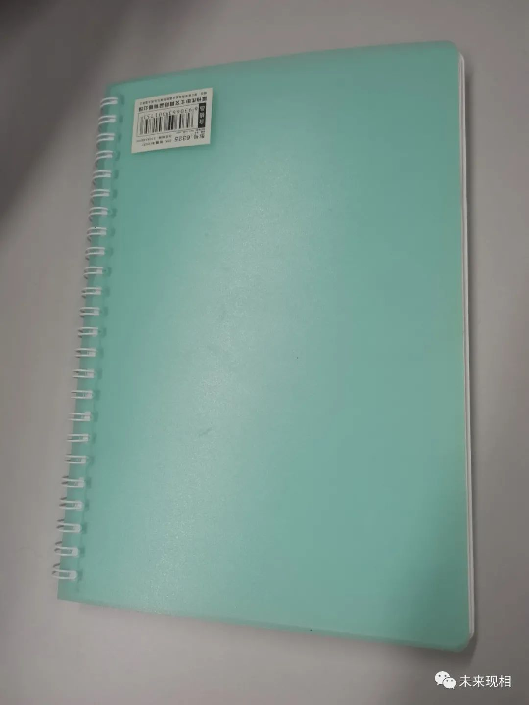
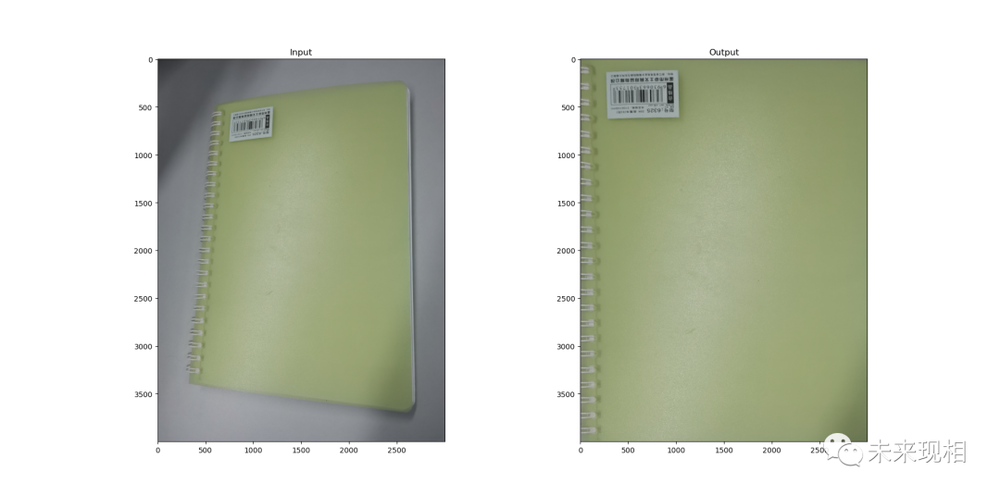

# [透视变换](https://mp.weixin.qq.com/s?__biz=MzI0OTIwMTY3OA==&mid=2247486764&idx=1&sn=d922e512a9eac01103009464e972b8eb&chksm=e994584ddee3d15b373f97584b33ca152e3e5749b6a452d0c71f8eb003326c75f697ecae6f1e&token=1990227272&lang=zh_CN#rd)

什么是透视变换矫正图像适用场景透视变换原理代码实现OUTPUT

## 什么是透视变换

透视变换通过投影的方式，把当前图像映射到另外一个平面，就像投影仪一样，如果幕布或者胶带其中任意一个与放映机发出的光纤不是垂直90度角的，那么投影到幕布上的图像就会发生畸变。这种畸变就是透视畸变的一种。

透视变换对畸变图像的校正需要取得畸变图像的
**一组4个点的坐标**，
和
**目标图像的一组4个点的坐标**，
通过两组坐标点可以计算出透视变换的变换矩阵，之后对整个原始图像执行变换矩阵的变换，就可以实现图像校正。

### 矫正图像适用场景

如图所示：



即，距离摄像头越近的点，看起来越大，越远的点看起来越小。对这幅图像透视校正的目的就是要纠正这种形变，得到书的正视角矩形图像，校正效果相当于是从本子的的正上方视角拍摄的。

## 透视变换原理

透视变换（Perspective Transformation）的本质是将图像投影到一个新的视平面，其通用变换公式如下：
$$
\left[x^{'},y^{'},w^{'}\right]=[u,v,w] *\left[\begin{array}{lll}
a_{11} & a_{12} & a_{13} \\
a_{21} & a_{22} & a_{23} \\
a_{31} & a_{32} & a_{33}
\end{array}\right]
$$
其中，（u，v）为原始图像像素坐标，（x=x’/w’，y=y’/w’）为变换之后的图像像素坐标。

即：
$$
\text { Transform }=\left[\begin{array}{lll}
a_{11} & a_{12} & a_{13} \\
a_{21} & a_{22} & a_{23} \\
a_{31} & a_{32} & a_{33}
\end{array}\right]=\left[\begin{array}{cc}
T_{1} & T_{2} \\
T_{3} & a_{33}
\end{array}\right]
$$

$$
\begin{array}{l}
T_{1}=\left[\begin{array}{ll}
a_{11} & a_{12} \\
a_{21} & a_{22}
\end{array}\right] \text { 表示图像线性变换。 } \\
T_{2}=\left[\begin{array}{ll}
a_{13} & a_{23}
\end{array}\right]^T \text { 用于产生图像透视变换。 } \\
T_{3}=\left[\begin{array}{ll}
a_{31} & a_{32}
\end{array}\right] \text { 表示图像平移。 }
\end{array}
$$

也就是说：给定透视变换对应的四对像素点坐标，即可求得透视变换矩阵；反之，给定透视变换矩阵，即可对图像或像素点坐标完成透视变换.

## 代码实现

```python
import numpy as np
import cv2 as cv
import matplotlib.pyplot as plt

if __name__=="__main__":

    img = cv.imread('notebook.jpg')
    rows,cols,ch = img.shape
    print(rows,cols,ch)
    pts1 = np.float32([[624,503],[2541,237],[318,3351],[2620,3630]])
    pts2 = np.float32([[0,0],[3000,0],[0,4000],[3000,4000]])
    M = cv.getPerspectiveTransform(pts1,pts2)
    dst = cv.warpPerspective(img,M,(3000,4000))
    plt.subplot(121),plt.imshow(img),plt.title('Input')
    plt.subplot(122),plt.imshow(dst),plt.title('Output')
    plt.show()
```

### OUTPUT

