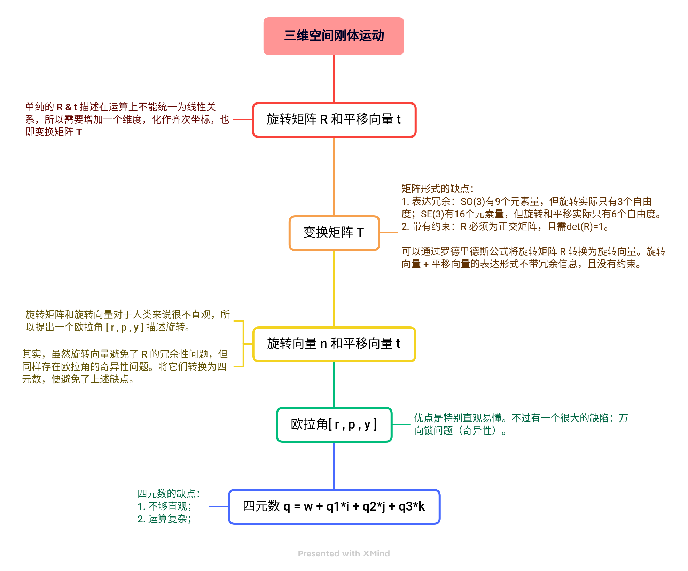

# SLAMBOOK NOTE

## 1、SLAM整体框架

SLAM整体框架图

### 1.1 传感器信息读取

在视觉SLAM中主要为相机图像信息的读取和预处理。如果是在机器人中，还可能有码盘、惯性传感器等信息的读取和同步。

### 1.2 视觉里程计（Visual Odometry，VO）

视觉里程计的任务是估算相邻图像间相机的运动，以及局部地图的样子。VO又称为**前端（Front End）**。VO与计算机视觉研究领域更为相关，比如图像的特征提取与匹配等。

- 缺陷：仅通过VO来估计轨迹，会出现**累计漂移**（Accumulating Drift）

- 解决方案：
  - 回环检测：负责检测“机器人回到原始位置”信息
  - 后端优化：根据回环检测的信息，校正整个轨迹形状

### 1.3 后端优化（Optimization）

后端接受不同时刻视觉里程计测量的相机位姿，以及回环检测的信息，对它们进行优化，得到全局一致的轨迹和地图。由于接在VO之后，又称为**后端（Back End）**。

主要是处理SLAM过程中的**噪声**问题，主要是利用滤波与非线性优化算法。

### 1.4 回环检测（Loop Closing）

回环检测判断机器人是否到达过先前的位置。如果检测到回环，它会把信息提供给后端进行处理。

主要解决位置估计随时间漂移的问题。

实质上是一种计算图像数据相似性的算法。

### 1.5 建图（Mapping）

它根据估计的轨迹，建立与任务要求对应的地图。地图大体可分为度量地图（Metric Map）和拓扑地图（Topological Map）两种。

- 度量地图：强调精确的表示地图中物体的位置关系。通常又分为**稀疏（Sparse）**与**稠密（Dense）**两种。
  - 稀疏：进行一定程度抽象，不需要表达所有物体，选择一部分具有代表意义的东西，称为**路标**，一张稀疏地图就是由路标组成的地图。一般用于定位。
  - 稠密：着重于建模所有看到的东西。一般用于导航。可以用于各种导航算法。如A\*,D\*等，缺点是耗费大量存储空间以及大规模度量地图的一致性问题。
- 拓扑地图：更强调地图元素之间的关系。是一个图（Graph），有节点和边组成，只考虑节点间的连通性。

### 1.6 SLAM问题的数学表述

假设:

- 离散时刻： $ t=1,\cdot\cdot\cdot,K $
- 各时刻位置： $ x_1,\cdot\cdot\cdot,x_K $
- 观测到的路标点：$ y_1,\cdot\cdot\cdot,y_N $

有：

- （从 $ k-1 $ 时刻到 $ k $ 时刻，位置 $ x $ 如何变化）**运动方程**：$  x_k=f(x_{k-1},u_k,w_k),\space\space k=1,\cdot\cdot\cdot,K $
  - $  u_k $ ：已知。运动传感器的输入（或读数）
  - $  w_k $ ：运动过程加入的噪声
- （在 $ k $ 时刻观察到了某一个路标点 $ y_j $）**观测方程**：$ z_{k,j}=h(y_j,x_k,v_{k,j}),\space\space (k,j)\in O $
  - $ z_{k,j} $ ：已知。观测数据
  - $ v_{k,j} $ ：观测过程加入的噪声
  - $ O $ ：集合，记录哪个时刻观察到了哪个路标

估计：

-  $ x $ 和 $ y $ 

## 2、三维空间刚体运动

**如何描述刚体在三维空间中的运动？**

我们日常生活的空间是三维的，三维空间由3个轴组成，所以一个空间点（**质点**）的位置可以由3个坐标指定。不过目前要研究的机器人、相机等物件可以看作**刚体**[^1]。与质点相比，对于刚体位置的描述，不仅要指出其在空间中的**位置坐标**（3个坐标），还要指出其自身的**姿态**（即刚体的朝向）[^2]。

**向量**是一种具有大小和方向的矢量（此处向量均默认为列向量）。当指定了空间中具有一组**基**的**坐标系**后，向量在这个坐标系下的坐标和其自身所代表的方向就可以描述刚体的**位姿**。

实际场景中会定义各种各样的坐标系，向量在不同坐标系下的坐标不同，所以需要一种数学手段描述向量在不同的坐标系下坐标的变换关系。两个坐标系之间的坐标相差了一个**欧式变换** （Euclidean Transform）。

欧式变换由一个**旋转**加一个**平移**组成。

### 2.1 旋转矩阵与平移向量

#### 2.1.1 旋转

假设向量 $ \vec a $  在坐标系1和坐标系2下的坐标分别为 $ a_1 $ 和 $ a_2$，两坐标系的基分别为 $ \vec e_1 $ 和 $ \vec e_2 $

有：
$$
\vec a ={\vec e_1}^{T} \cdot a_1 \\
\vec a ={\vec e_2}^{T}\cdot a_2
$$
即：
$$
{\vec e_1}^{T} \cdot a_1 ={\vec e_2}^{T}\cdot a_2
$$
同时左乘 $ \vec e_1 $ ，有：
$$
\vec e_1 \cdot {\vec e_1}^{T} \cdot a_1 =\vec e_1 \cdot {\vec e_2}^{T}\cdot a_2\\
\vec I \cdot a_1 =\vec e_1 \cdot {\vec e_2}^{T}\cdot a_2\\
a_1 =\vec e_1 \cdot {\vec e_2}^{T}\cdot a_2
$$
那么，两个坐标系的两组基之间的内积（即 $\vec e_1 \cdot {\vec e_2}^{T}$ ）组成**旋转矩阵**$\ R$ （Rotation Matrix.），刻画了旋转前后同一个向量的坐标变换关系：
$$
a_1=R\cdot a_2=R_{12}\cdot a_2
$$
其中，$ R_{12} $ 的表示含义为 **把坐标系2的向量变换到坐标系1中**

又因为旋转矩阵是一个行列式为1的正交矩阵。所以n 维度旋转矩阵的集合可定义为**特殊正交群**（Special Orthogonal Group）：
$$
SO(n)=\left \{ R\in \mathbb{R}^{n\times n} \mid RR^{T} =I,det(R)=1\right \}
$$
由于旋转矩阵为正交矩阵，所以它的逆${R}^{-1}$（即转置${R}^{T}$）描述了一个相反的旋转。
$$
a_2={R}^{-1}\cdot a_1={R}^{T}\cdot a_1
$$

#### 2.1.2 平移

$\ t$ 称为平移向量。相比旋转，平移部分只需要把平移向量加到旋转之后的坐标上：
$$
a_1=R_{12} \cdot a_2+t_{12}
$$

其中，$ t_{12} $ 的表示含义为 坐标系1原点指向坐标系2原点的向量，**在坐标系1下取的坐标**

反过来的 $ t_{21} $ ，即从坐标系2原点指向坐标系1原点的向量，在坐标系2下取的坐标，并不等于$ -t_{12} $

证明过程：[《视觉SLAM十四讲》互为反向的平移向量坐标值的关系](https://zhuanlan.zhihu.com/p/364906722)

#### 2.1.3 总结

通过上述，用一个旋转矩阵$\ R $ 和一个平移向量$\ t$ 完整描述了一个欧式空间的坐标变换关系。

然而还存在一个小问题：**这里的变换关系不是线性关系**。

### 2.2 变换矩阵与齐次坐标

引入齐次坐标和变换矩阵来处理上述的小问题。将一个三维向量的末尾添加1，将其变成四维向量，进行降维打击。这被称为**齐次坐标**。矩阵**T**称为**变换矩阵**（Transform Matrix）。
$$
\begin{bmatrix}a'
 \\1
\end{bmatrix}=\begin{bmatrix}R
  & t\\0^{T} 
  & 
1\end{bmatrix}\begin{bmatrix}a
 \\1

\end{bmatrix}\overset{def} {=} T\begin{bmatrix}a
 \\1

\end{bmatrix}
$$
变换矩阵这种矩阵又称为**特殊欧氏群**（Special Euclidean Group）:
$$
SE(3)=\left \{  T=\begin{bmatrix}R
  & t\\0^{T} 
  & 
1\end{bmatrix}\in \mathbb{R}^{4\times 4} \mid R\in SO(3),t \in \mathbb{R}^{3}  \right \}
$$
与特殊正交群一样，变换矩阵的逆矩阵表示一个反向的变换。

------

#### 2.2.1 总结

旋转由旋转矩阵SO（3）描述，平移直接由一个三维向量描述。将旋转和平移放在一个矩阵中，就形成了变换矩阵SE（3）.这个变换矩阵描述了一个6自由度的三维刚体运动，不过矩阵表示方式至少有**两个缺点**：

1. SO（3）的旋转矩阵有9个量，但一次旋转只有3个自由度；SE（3）有16个量，表达了6自由度的欧式变换。表达方式是**冗余**的。
2. 旋转矩阵自身带有**约束**：必须是正交矩阵且行列式为1。变换矩阵同理。这些约束使得求解变得困难。

因此，需要一种方式来**紧凑**的描述旋转和平移。

### 2.3 旋转向量与欧拉角

#### 2.3.1 旋转向量

任意旋转都可以用一个**旋转轴**和一个**旋转角**来刻画。

于是，使用一个向量，其方向与旋转轴一致，长度等于旋转角，这种向量称为**旋转向量**，也称为**角轴**（Angle-Axis）。此时，只需要一个三维向量即可描述旋转；同样，使用一个旋转向量和一个平移向量即可描述一次变换，这时正好是六维向量。

表示一个旋转，可以用旋转矩阵$ \ R $ 。假设旋转轴为**单位向量** $ \vec n $，旋转角度为 $\theta$，那么向量 $\theta \vec n$ 也可描述该旋转。

- 旋转矩阵和旋转向量如何转换？

  - 旋转向量$\longrightarrow $旋转矩阵[^3]：
    $$
    R=\cos\theta \mathit{I} + \left ( 1-\cos \theta  \right )  \vec n \vec n^{T} +  \sin \theta \vec n^{\wedge }
    $$
    
  - 旋转矩阵$\longrightarrow $旋转向量[^4]：
  
  $$
  \theta =\arccos \frac{tr\left ( R \right )-1 }{2}
  $$
  
  
转轴n是旋转矩阵R特征值1对应的归一化特征向量 

  
  > 注：旋转轴上的向量在旋转后不会发生改变，所以 $ R\vec n=1\vec n $ ，即有上述。
  >
  > $ ^\wedge $ 符号：将一个向量变为对应的反对称矩阵。然后则有外积： $ a\times b=a^\wedge b $
  >
  > $^\vee$ 符号：将一个反对称矩阵变为对应的向量。若 $ A $ 为反对称矩阵，则 $ a^\wedge=A $，$ A^\vee=a $

#### 2.3.2 欧拉角

旋转矩阵和旋转向量对于人类不直观，**欧拉角**提供了一种直观的方式来描述旋转——使用三个分离的转角，，把一个旋转分解成3次绕不同轴的旋转。不过欧拉角的定义方式很多，带来了很多困难。这里介绍rpy角，它的绕轴旋转顺序是Z（偏航角yaw）Y（俯仰角pitch）X（滚转角roll）。

欧拉角的一个**重大缺点**是著名的**万向锁问题**（Gimbal Lock）：在俯仰角（即绕Y轴的角）为±90°时，第一次旋转与第三次旋转将使用同一个轴，使得系统丢失了一个自由度。这被称为**奇异性**问题（旋转向量同样有此问题）。 

**万向锁问题**：这种现象的发生就是由于上述固定坐标轴旋转顺序造成的。理论上，欧拉旋转可以靠这种顺序让一个物体指到任何一个想要的方向，但如果在旋转中不幸让某些坐标轴重合了就会发生万向节锁，这时就会丢失一个方向上的旋转能力，也就是说在这种状态下我们无论怎么旋转（当然还是要原先的顺序）都不可能得到某些想要的旋转效果，除非我们打破原先的旋转顺序或者同时旋转3个坐标轴。由于万向节锁的存在，欧拉旋转无法实现球面平滑插值。                                                                                                                                                                                                                                                                                                                                                                                                                                                                                                                                                                                                                                                                                                                                                                                                                                                                                                                                                                                                                                                                                                                                                                                                                                                                                                                                                                                                                                                                                                                                                                                                                 

**用途**：验证算法是否有错，转换成欧拉角能快速分辨结果是否正确。某些主体主要为2D场合，也可以把旋转分解为三个欧拉角，然后把其中一个拿出来做定位输出。

[万向锁问题参考资料1](https://www.cnblogs.com/psklf/articles/5656938.html)

[万向锁问题参考资料2](https://mp.weixin.qq.com/s/zrbTbBuXFujgGFfkwxJ-hg)

### 2.4 四元数

旋转矩阵用9个量描述3自由度的旋转，具有冗余性；旋转向量和欧拉角是紧凑的，但具有奇异性。

事实上，我们**找不到不带奇异性的三维向量描述方式**。

**四元数**（Quaternion）可以描述三维空间的旋转，它既是紧凑的，也没有奇异性。

[阅读材料1：quaternion.pdf](../book/quaternion.pdf)

[阅读材料2：Understanding_Quaternions Chinese](../book/Understanding_Quaternions_CN.pdf)

[阅读材料3：形象理解四元数](https://www.zhihu.com/question/23005815/answer/33971127)

[视频：四元数的可视化](https://www.bilibili.com/video/BV1SW411y7W1)

## 3、李群与李代数

**什么样的相机位姿最符合当前观测数据？**这就需要构建一个优化问题，求解最优 $ R,t $ ，使得误差最小化。

旋转矩阵自身带有约束（正交且行列式值为1）。将之作为优化变量会引入额外约束，使优化变困难。

所以我们希望通过李群—李代数的转换关系，将位姿估计变成无约束的优化问题。

#### 3.1.1 李群与李代数

**群**（Group）是**一种集合**加上**一种运算**的代数结构。

现在把集合记作$ \ A $ ，一种运算记作 $ \cdot $ ，群记作$ \ G=(A, \cdot) $ ，群要求运算满足以下四个条件：

1. 封闭性：集合中的两个元素运算后还属于该集合；
2. 结合律：元素运算的先后顺序不影响结果；
3. 幺元：存在一个单位元，使得每个元素与之运算的结果都是元素本身；
4. 逆元：对于集合内所有的元素，都有其对应的逆元素，使得元素与对应逆元素运算结果为单位元；

**李群**是指具有连续（光滑）性质的群。

李群的**例子**： $ SO(3) $ 和 $ SE(3) $

------

**李代数**：由一个集合$\mathbb V$、一个数域 $\mathbb F$ 和一个二元运算$\ [,]$ 组成，称$(\mathbb V,\mathbb F,[,]) $ 为李代数，记作 $\mathfrak g$

需满足以下性质：

1. 封闭性：同一集合的两元素运算过后还属于该集合
2. 双线性
3. 自反性：自己与自己运算结果为零
4. 雅可比等价

其中：二元运算被称为**李括号**。

每个李群都有与之对应的李代数。**李代数描述了李群的局部性质（单位元附近的正切空间）**。

李代数的**例子**： 

$ SO(3) $ 对应的李代数 $ \mathfrak {so}(3) $ 为三维向量 $ \phi $ 。每个 $ \phi $ 都可以生成一个反对称矩阵 $ \Phi = \phi ^\wedge \in \mathbb R^{3\times 3} $。

有：$ \mathfrak {so}(3) =\{\phi \in \mathbb R^3,\Phi=\phi^\wedge \in \mathbb R^{3\times 3}  \}$ 。其可以用来表达旋转矩阵的导数。

 $ SO(3) $ 与 $ \mathfrak {so}(3) $ 关系为： $ R=exp(\phi^\wedge) $ 

此定义下，两个向量的李括号为： $ [\phi_1,\phi_2]=(\Phi_1\Phi_2-\Phi_2\Phi_1)^\vee $

------

$ SE(3) $ 对应的李代数 $ \mathfrak {se}(3) $ 为六维向量 $ \xi $ 。
$$
\mathfrak{s e}(3)=\left\{\boldsymbol{\xi}=\left[\begin{array}{c}
\rho \\
\phi
\end{array}\right] \in \mathbb{R}^{6}, \rho \in \mathbb{R}^{3}, \phi \in \mathfrak{s o}(3), \boldsymbol{\xi}^{\wedge}=\left[\begin{array}{cc}
\phi^{\wedge} & \rho \\
0^{T} & 0
\end{array}\right] \in \mathbb{R}^{4 \times 4}\right\}
$$
其中，前三位为平移（与变换矩阵平移不同），记为 $ \rho $ ；后三维为旋转，记为 $ \phi $ ，实质为 $ \mathfrak {so}(3) $ 。

注意：在 $ \mathfrak {se}(3) $ 中，使用 $ ^\wedge $ 符号表示将一个六维向量转换成四维矩阵：
$$
\boldsymbol{\xi}^{\wedge}=\left[\begin{array}{cc}
\boldsymbol{\phi}^{\wedge} & \boldsymbol{\rho} \\
\mathbf{0}^{T} & 0
\end{array}\right] \in \mathbb{R}^{4 \times 4}
$$
此定义下，两个向量的李括号为：$ \left[\xi_{1}, \xi_{2}\right]=\left(\boldsymbol{\xi}_{1}^{\wedge} \boldsymbol{\xi}_{2}^{\wedge}-\boldsymbol{\xi}_{2}^{\wedge} \boldsymbol{\xi}_{1}^{\wedge}\right)^{\vee} $ 

## 0、注释

[^1]:在[物理学](https://zh.wikipedia.org/wiki/物理学)里，理想**刚体**（rigid body）是一种有限尺寸，可以忽略[形变](https://zh.wikipedia.org/wiki/形變)的[固体](https://zh.wikipedia.org/wiki/固体)。不论是否感受到[外力](https://zh.wikipedia.org/wiki/作用力)，在刚体内部，[质点](https://zh.wikipedia.org/wiki/質點)与质点之间的[距离](https://zh.wikipedia.org/wiki/距离)都不会改变。这种理想模型适用条件是，运动过程比固体中的弹性波的传播要缓慢得多。根据[相对论](https://zh.wikipedia.org/wiki/相對論)，这种物体不可能实际存在，但物体通常可以假定为完美刚体，前提是必须满足运动速度远小于[光速](https://zh.wikipedia.org/wiki/光速)的条件。
[^2]:刚体是由一群数量超多的质点组成。实际而言，不可能精确地追踪其中每一个质点的运动。为了简化运算，可以利用刚体的“刚性”，即其内部所有质点彼此之间距离不变的性质。假若物体具有刚性，则倚靠设定三个不共线质点的位置，就足以设定此物体的位置。这意味着，在三维空间里，刚体至多只有九个[自由度](https://zh.wikipedia.org/wiki/自由度_(物理学))，但由于假定三个质点之间的距离固定不变，所以，刚体只有六个自由度。假设还有其它约束，例如，刚体的运动必需绕着其内部一点旋转（定点转动），或绕着其内部一直轴旋转（定轴转动），则自由度会小于六。
[^3]:符号^是向量到反对称矩阵的转换符。

$$
a^{\wedge } =\begin{bmatrix}0
  & -a_{3}  &a_{2}  \\a_{3} 
  & 0 & -a_{1}  \\-a_{2} 
  & a_{1}  &0
\end{bmatrix}
$$

[^4]: tr求迹是求矩阵的对角线之和。

